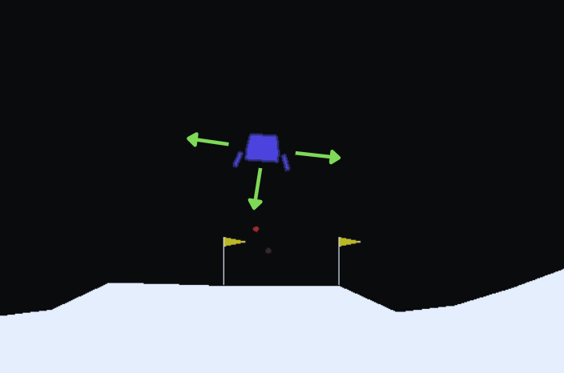

# LunarLander-v3 Deep Q-Network Project

  

This project trains an AI agent to land a lunar module safely using Deep Q-Network (DQN). It demonstrates how reinforcement learning can solve complex control tasks in the LunarLander-v3 environment from Gymnasium.

---
## Project Overview

The LunarLander-v3 environment is a 2D physics simulation where you control a lunar lander aiming to touch down gently on a designated landing pad. The environment provides an **8-dimensional continuous observation space**:  
- x and y coordinates of the lander  
- x and y velocities  
- lander angle  
- angular velocity  
- two booleans indicating whether each leg is in contact with the ground.

The **action space** is discrete with 4 possible actions:  
- 0: do nothing  
- 1: fire left orientation engine  
- 2: fire main engine  
- 3: fire right orientation engine.

The agent learns to fire thrusters efficiently, balance vertical and horizontal speeds, and land gently between two flags. Rewards are given for successful landings and penalties for crashes or excessive fuel use.

## Deep Q-Learning Explained

### Core Components
- **State**: 8-dimensional vector (position, velocity, angle, etc.)
- **Actions**: 4 possible moves (do nothing, fire main engine, left/right thrusters)
- **Q-Function**: Neural network that estimates expected rewards

### Key Equations

**1. Q-Learning Update Rule**  
`Q(s, a) ← Q(s, a) + α [ r + γ max_a' Q(s', a') - Q(s, a) ]`

**2. Neural Network Loss**  
`L = E[(Q_target - Q_predicted)^2]`

**3. Target Network Update**  
`θ_target ← τ * θ_local + (1 - τ) * θ_target`

### Technical Features
- **Experience Replay**: Stores 100,000 past experiences to break correlations
- **Epsilon-Greedy Exploration**: Starts at 100% random actions, decays to 1%
- **Double Network Architecture**: Local network for actions, target network for stability

---

## Usage
If you want to explore the project interactively, there’s a Jupyter notebook included. It walks through training the LunarLander agent step-by-step and lets you experiment with the code and parameters directly.

U can use jupyter notebook or google colab.

Open the provided notebook file (e.g., LunarLander_DQN.ipynb).

Run the cells in order to train the agent, visualize results, and tweak settings.

This notebook is a great way to see how the training process works and to try out changes without running scripts from the command line.
